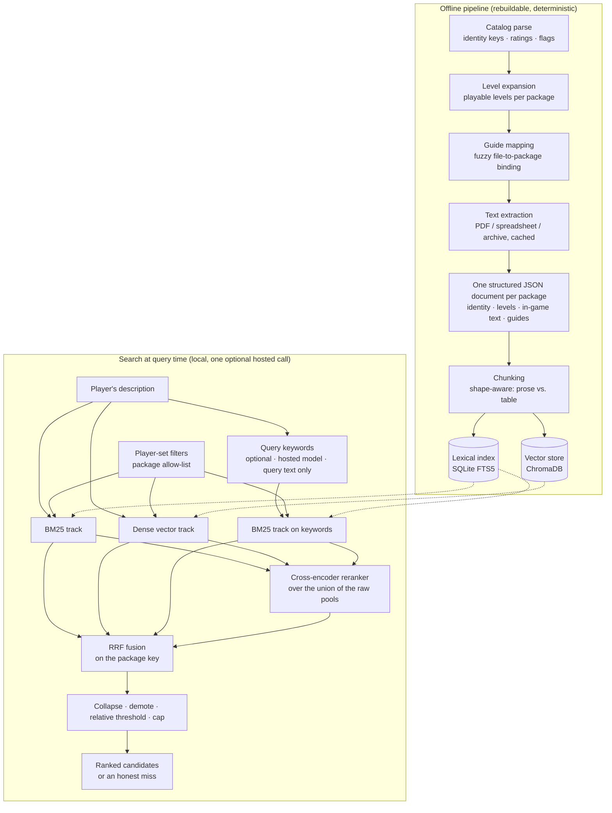

# Fan Mission Search (Thief 1 & 2)

A local search system that finds one of roughly 1,400 community-made releases
("fan missions") for *Thief: The Dark Project* / *Thief Gold* (1998) and
*Thief II: The Metal Age* (2000), from a player's half-remembered description.

**This repository contains documentation only — no source code and no corpus.**
The application is a private project; the material it indexes is third-party work
(community walkthroughs, author-written in-game text) that is not mine to
republish. What is public here is the engineering: the architecture, the decisions
and their reasons, and the retrieval evaluation that shaped the pipeline.

Both games run on the same engine, which is why one extraction pipeline covers
both: archives, string tables and level files follow the same conventions. Their
*content* is kept strictly apart — see the identity rules under
[Data pipeline](#data-pipeline).

The evaluation story is the more interesting document:
**[RETRIEVAL_EVAL.md](RETRIEVAL_EVAL.md)** — six retrieval strategies measured
and rejected, one defect diagnosed and fixed, one query-side change measured
and integrated, all against a frozen gold set.

A live demo can be shown on a call.

---

## The problem

A player half-remembers a level from years ago — the shape of a room, an unusual
enemy, the weather on the approach — and wants to find it again among 1,400
candidates. Some of what a player remembers is written down somewhere, and that
material is a heap: hundreds of PDFs and spreadsheets written by dozens of authors
in no common format, plus text sealed inside game archives (objectives, in-game
books and notes, mission titles), plus a desktop loader's catalog file as the only
registry of what exists. Some of it is written down nowhere, and that sets the
ceiling for what any search over this corpus can reach.

Three properties make this harder than a document search:

- **The query and the corpus do not share a vocabulary.** The player remembers
  *a monster*, the guide says the creature's proper name; the player remembers
  *a ramp*, the guide says *stairs*. Questions also arrive in German while the
  corpus is English.
- **One answer can be one level inside a campaign**, and a campaign's walkthrough
  is usually one file for all its levels. Finding the package is not the same
  achievement as finding the level.
- **Identity is a data problem before it is a ranking problem.** The same story
  exists as several re-releases, as ports to the other game, and under titles that
  differ by spelling between the catalog and the guide filenames.

## Scope of this documentation

This describes the **search** half of the project and its evaluation. Search is
where the engineering is: fusion of three retrieval tracks, a measured ranking
defect, and the data pipeline that makes any of it possible.

The project also has a path for a question about a level the player *can* name.
That path is deliberately **not** a retrieval problem — a named level needs
identity resolution and then its full context, not ranked fragments. It is out of
scope here, as is a recommendation feature built on the player's own ratings.
Keeping the two apart was the first architectural decision and the reason the
index only ever had to serve the finder.

---

## Architecture

Two halves: an **offline pipeline** that turns archives and guide files into one
structured document per package plus two indexes, and a **query-time search** that
fuses three ranked lists — plus an optional fourth from query keywords — into one
candidate list, optionally inside a player-set package allow-list. The pipeline is fully
local; search is local except for one optional hosted call that sends the query
text and nothing else.

### The three tracks

1. **BM25** over the lexical index — carries proper nouns, place names, item names.
2. **Dense vectors** from a multilingual embedding model — carries paraphrase and
   the second language, since questions arrive in German and the corpus is English.
3. **A cross-encoder reranker** scoring query and chunk together, over the union
   of the two raw pools.

**An optional fourth track.** One hosted call, on the query text only, returns
keywords in walkthrough and game-world vocabulary; those become an extra BM25
track. The reranker still scores the player's original query, so the extra words
can bring candidates in but do not re-weight it. On 52 rows the track gained
**+4 hit@10** in each of three samples. It is on by default, can be switched off,
and Find falls back to the local three tracks if the call fails — see
[RETRIEVAL_EVAL.md §6](RETRIEVAL_EVAL.md#6-after-the-fusion-fix-the-query-side).

**Player-set filters.** Release year, author, game, campaign yes/no and category
tags become a package allow-list applied **before** BM25 and vector search, not
after the pool. No re-embed and no index rebuild: release dates and tags sit in
side tables next to the index and are read at query time. Unknown stays in and is marked — an undated package under a year filter, an
empty author, a package with no tags.

Fusion happens on the **package** key, not the chunk key. That single change is the
subject of [RETRIEVAL_EVAL.md](RETRIEVAL_EVAL.md) and was worth more than every
parameter variant measured around it.

An empty list after thresholding returns an **honest miss** — "no match in the
index" plus what was searched. Not a clarifying question, which would imply that
candidates exist.

---

## The search runs on one machine

Not a deployment detail. It is a constraint the engineering is built around, and
it is deliberate.

The lexical index is a single SQLite file. The vector store is local. Embedding
and reranking run on one 16 GB consumer GPU. Extraction caches sit on disk, keyed
by content hash, so a rebuild is a script run rather than a re-download. **No
indexed text leaves the machine** — no hosted vector database, no embedding API,
no reranking service. One optional step calls a hosted model: Find can send the
player's own query, and nothing else, to a language model that returns extra
search keywords. It is on by default, can be switched off, and search falls back
to fully local when it is off or unreachable.

That shaped concrete decisions: the encoder runs in FP16 because the model plus a
batch has to fit in the card; the candidate pool is 200 deep because reranker time
grows linearly with it; a full re-embed of 84,090 chunks takes about 16 minutes at
roughly 85 chunks per second, which is what makes "rebuild and re-measure" a
routine step instead of an event.

And it settles a question that a corpus of other people's work should raise: the
walkthroughs and in-game texts indexed here were written by community authors, and
they are held for one person's private use. Processing them locally is how that
stays true.

---

## Tech stack

| Layer | Choice | Why |
|---|---|---|
| Lexical retrieval | SQLite FTS5 | Zero-infrastructure BM25; the whole index is one file |
| Vector store | ChromaDB, local | Same reason; metadata filters on every row |
| Embeddings | BGE-M3, FP16 on a 16 GB consumer GPU | Multilingual: German questions against an English corpus |
| Reranking | BGE-reranker-v2-m3, self-hosted | Beats hand-tuned score heuristics at ~200 candidates |
| Fusion | Reciprocal Rank Fusion, k=60, on the package key | Combines incomparable score scales without calibration |
| Extraction | Layout-preserving PDF text; spreadsheet readers for three formats; zip/7z recursion with ratio and volume guards | Guide files are loose, nested and inconsistent; the guards make a hostile archive skip-and-log instead of abort |
| Interface | CLI plus a local web page for Find (FastAPI, React) | The first surface should expose raw rows, not hide them |
| Query keywords | Claude Haiku 4.5, hosted; query text only, optional | The only hosted call; kept because it cleared a pre-written rule in three samples |
| Filters | Player-set fields → package allow-list before retrieval | Applied at query time: no re-embed, no rebuild |
| Runtime | Python, local GPU, content-hashed caches | Rebuilds are a script run, not a re-download |

---

## Data pipeline

The pipeline's hard part is not parsing — it is **identity**.

**Three keys, kept strictly apart.** A *package* is one download, one release. A
*level* is one playable mission inside it — the community calls a whole download a
"fan mission", so this document says *package* for the download and *level* for one
playable mission, to keep the two from blurring. A *version group* holds re-releases
of the same package by the same author for the same game. Ports of one story to the
other game are explicitly *not* the same group: they are different playable content.
Every indexed row carries package id, version group and level id from day one, so a
rebuild is cheap and the ranking layer never has to re-query a registry.

**Level expansion.** Level counts in the catalog are a hint, not a fact — some rows
advertise a dozen levels and contain none. Levels are derived from the archive's own
file listing under a structural rule, every rejected candidate is logged with its
full path, and packages that genuinely have no playable level keep an empty list
with an explicit *unavailable* marker rather than a synthetic one. Measured result:
1,913 levels across 1,389 packages, with a single rule covering every package that
has playable content and no fallback branch firing.

**Guide mapping is fuzzy matching with a precision bias.** Walkthroughs are loose
PDFs, PDFs nested up to three levels deep inside archives, plain-text guides and
spreadsheets, named by uploaders rather than authors. Binding is *file to package*,
many-to-many. The matcher normalises aggressively (CamelCase splitting, punctuation
folding, articles dropped at every word position, not just leading), tries the
filename first, then the first visible line of the PDF as a second lookup — and
when both bind uniquely to *different* packages, the title line wins, because the
filename is an uploader's abbreviation while line one is the author's own title.

Two rules matter more than the matcher:

- **Auto-bind only on a unique winner.** Ambiguity goes to a report, never to a
  guess. A wrong bind attaches one level's guide to another level, which would
  poison every downstream row for both. An unbound guide is cheap: the package is
  simply searchable on less text, and the coverage report says so.
- **A hand-curated list always beats the automaton**, is never overwritten, and
  conflicts are logged. Coverage went from 25 % to 81 % through successive matcher
  rules, each measured in isolation before being combined, and the last large step
  was a reviewed hand list.

**Shape-aware chunking.** A prose walkthrough and a loot table are not the same
document. Tables are chunked row-aware so a row is never cut in half, because the
paragraph chunker only breaks on blank lines and would slice a gapless table at the
character limit. Documents that alternate between prose and table sections are
segmented first and each block chunked by its own kind — a naive single split point
mislabelled 398 of 402 lines in one real file as table when only 26 % were. The
segmenter was probed on the whole corpus before it touched product code: 88 % of
297 mixed documents came out fully clean.

**Extraction over format rules.** The most useful lesson came from a bug class that
appeared more than once: a format rule applied to broken input produces
clean-looking errors. Two-column blocks of independent items sit on one text
baseline in the PDF, so a layout extractor reads them as single rows — and every
downstream rule then operates confidently on wrong pairs. The fix belongs in
extraction, never in a stricter instruction to whatever consumes the text; and
where the source genuinely does not encode the pairing, the honest output is a gap,
not a guess.

---

## Scale and coverage (measured, not estimated)

| | Thief 1 | Thief 2 | All |
|---|---:|---:|---:|
| Packages indexed | 305 | 1,125 | **1,430** |
| With ≥1 prose walkthrough | 255 (84 %) | 912 (81 %) | **1,167 (82 %)** |
| Without prose | 50 | 213 | **263 (18 %)** |

Playable levels: **1,913** in 1,389 packages · Indexed chunks: **84,090**.

Coverage is reported as *prose walkthrough* only. Packages whose sole mapped
document is a loot table are their own bucket — they are searchable on that table,
but counting them as "has a walkthrough" would inflate the number that matters.

---

## Design decisions worth reading

- **Identity before ranking.** Every ranking bug in the evaluation traced back to a
  key choice, not to a weight.
- **Defaults declared as unmeasured.** Pool size, demotion heuristics and thresholds
  were written down as *defaults that hold until first measurement* — explicitly not
  as decisions. Several were later measured and moved; one survived only as a
  documented assumption, and the documentation says so.
- **Look at rows before tuning ranks.** The build order forbade fusion, collapsing
  and thresholds until raw lexical hits had been read in a terminal.
- **Honest misses over plausible ones.** An empty result says so and says what was
  searched.
- **Gold scope is written on every eval pair.** Some questions are satisfied by
  finding the right package; others require the right level inside a campaign.
  Folding both into one number hides which of the two moved.
- **Local by design, not by budget.** See above — it is also why the measurements
  are reproducible on one machine.
- **Baseline first, then a model where it measurably helps.** Retrieval was built
  and measured without any language model first. The model step had to beat that
  baseline under a data boundary: query text may leave the machine; corpus text
  does not.
- **Facts from fields, vocabulary from a model.** A model reading of dates from
  the query was unreliable. The player sets the filter, and what is set is what
  is applied.

---

## Limits, stated plainly

- **The corpus is deliberately only what I already hold** — game archives and guide
  files. Reviews, forum threads and other descriptive writing are not indexed,
  because collecting them would mean crawling other people's sites, which was ruled
  out. The consequence is a coverage limit rather than a ranking one: a memory of a
  level's mood, its difficulty or how it played usually has no counterpart in a
  walkthrough, which records what to do and not what it was like. No fusion key or
  weight reaches that; only different source material would.
- Roughly one package in five has no prose walkthrough. For those, search runs on
  in-game text only — a weaker corpus — and the coverage report keeps that visible
  rather than averaging it away.
- 90 % of indexed chunks are not bound to a specific level. For single-level
  packages that costs nothing; for large campaigns it means an entire walkthrough
  sits in the index as one package-level blob, and no query can aim at one level
  inside it. This is unbuilt scope, measured and scheduled, not a defect — see
  [RETRIEVAL_EVAL.md](RETRIEVAL_EVAL.md).
- Gold sets are small (22 frozen queries, an 18-query second split, 10 real forum
  questions, one date query). Every number here is a lower bound on a small sample,
  and the evaluation document says where overfitting risk sits.
- Filters are not yet measured as retrieval. The category list covers 1,251 of
  1,430 packages and records main aspects only. The keyword step's gain is one
  model, 52 rows, mostly at the edge of the top 10; latency is unmeasured.
- Some extraction limits are named and accepted rather than solved: two-column
  blocks of independent items on one text baseline stay unordered, because layout
  extraction cannot restore a pairing the PDF never encoded.

---

## Where it stands

- Three local tracks fused on the package key.
- An optional query-keyword track, integrated, on by default.
- Player-set filters, including category tags from a curated list — integrated, not
  yet measured as retrieval.
- A CLI and a local web page for Find.
- Next measured bottleneck: level binding inside campaigns, then package-found
  and mission-found as separate columns.
- Model steps that need corpus text are only possible with a local model; they
  are not built.

---

## What this repository is not

No source code, no corpus, no catalog data, no walkthrough text, no game assets.
The numbers, tables and failure analyses are from my own measurement runs; the
material they were measured on stays where it belongs.

---

## License and affiliation

Both documents are © 2026 Stefan Baade and licensed under
[CC BY-NC-ND 4.0](LICENSE). That license covers this prose only — no third-party
material is contained in or licensed by this repository.

*Thief: The Dark Project*, *Thief Gold* and *Thief II: The Metal Age* are products
and trademarks of their respective rights holders. This is an unaffiliated,
non-commercial fan and portfolio project, named descriptively and using no game
assets. Fan missions and walkthroughs are the works of their individual authors and
are not reproduced here. See [DISCLAIMER.md](DISCLAIMER.md).
